# Workplace Readable

[English](README.md) | 日本語

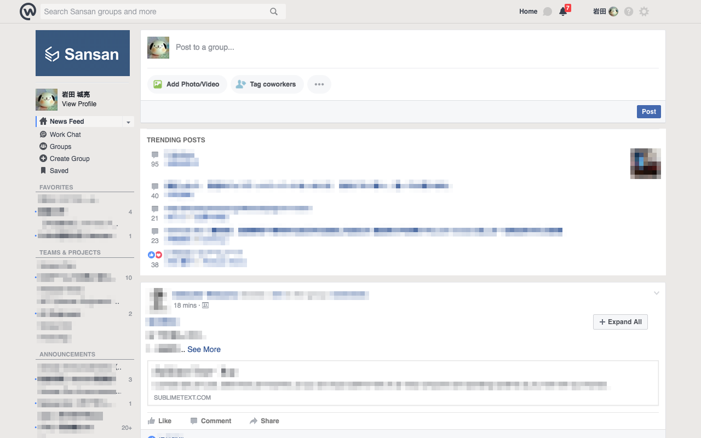

Workplace を少しだけ読みやすくする Chrome 拡張です。
今のところ約 10 個の機能を提供しています。

## インストール

* Chrome ウェブストア (近日公開)

## 機能

1. [ページ右端にあるサイドバーを非表示にする](#feature1)
2. [コンテンツ右隣にあるサイドバーを非表示にする](#feature2)
3. [コンテンツ領域の幅を広げて投稿を見やすくする](#feature3)
4. [右サイドバー内のトレンド投稿をコンテンツ領域に表示する](#feature4)
5. [縮小された投稿を展開する「全て展開」ボタンを配置する](#feature5)
6. [ページ右下に「トップに戻る」ボタンを配置する](#feature6)
7. [自分へのメンションを少しだけ目立たせる](#feature7)
8. [「最近のアクティビティ/過去の投稿」ヘッダーを少しだけ目立たせる](#feature8)
9. [左サイドバーのサブヘッダーを少しだけ目立たせる](#feature9)

### 1. ページ右端にあるサイドバーを非表示にする

#### Before

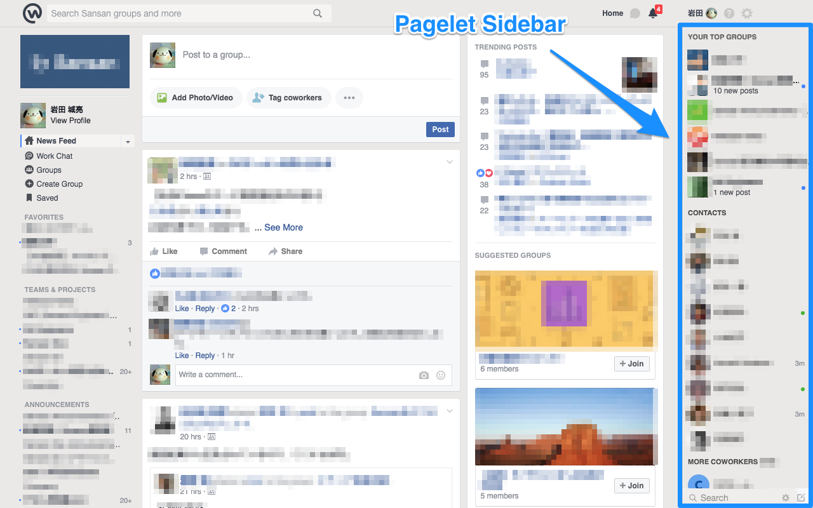

#### After

ページ右端に固定表示される (ページレット) サイドバーを非表示にします。
サイドバー内に表示される以下の機能が不要な人におすすめです。

- トップグループ
- 連絡先
- 他の同僚
- 検索

これまで「トップグループ」を使っていた人は、代わりに左サイドバーの「お気に入り」をお使いください。

### 2. コンテンツ右隣にあるサイドバーを非表示にする

#### Before

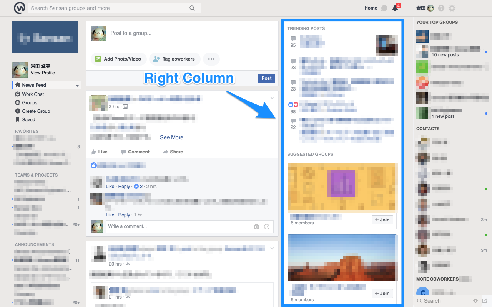

#### After

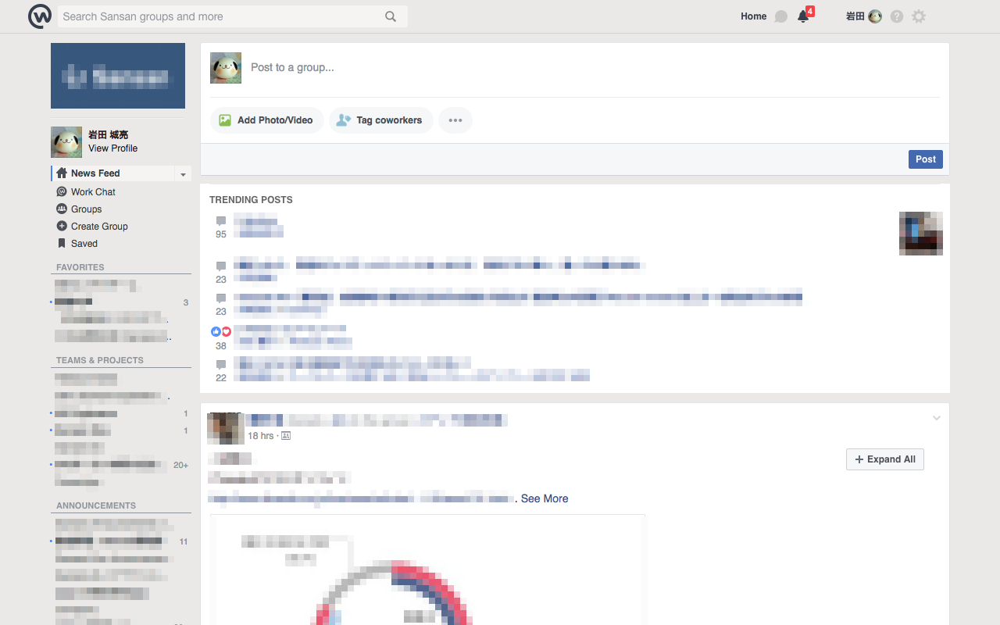

コンテンツの隣にある右サイドバーを非表示にします。
サイドバー内に表示される以下の機能が不要な人におすすめです。

- ホーム
  - トレンド投稿
  - おすすめのグループ
  - ご意見・ご感想
  - 言語選択
- グループ
  - メンバーを追加
    - メンバー
    - 説明
    - グループの種類
  - メーリングリストを招待
  - グループチャット
  - グループを作成
  - 最近のグループ写真
  - おすすめのグループ
  - 言語選択

### 3. コンテンツ領域の幅を広げて投稿を見やすくする

#### Before

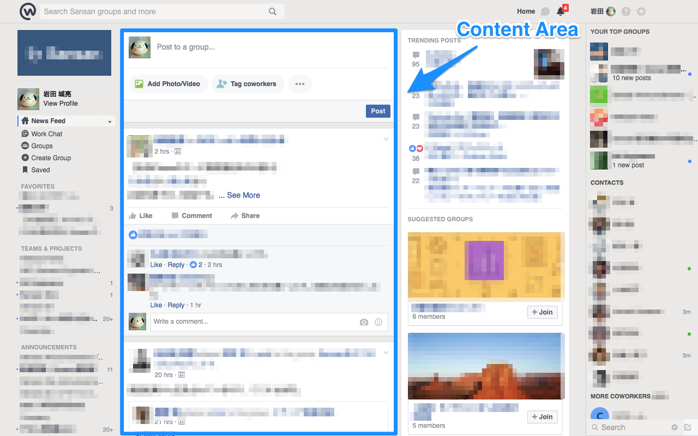

#### After

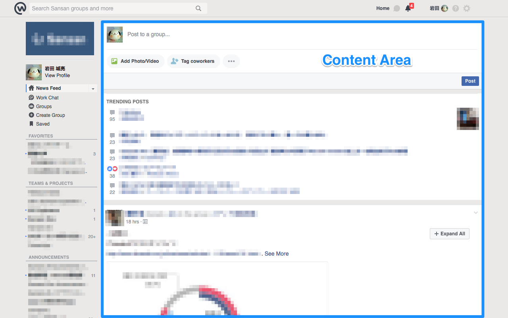

コンテンツ領域の幅を広げて投稿を見やすくします。
Workplace のメインコンテンツである投稿内容に集中できます。

またリキッドデザインの適用により、コンテンツ領域の幅がウィンドウ幅に応じて拡大/縮小されるようになります。

### 4. 右サイドバー内のトレンド投稿をコンテンツ領域に表示する

#### Before

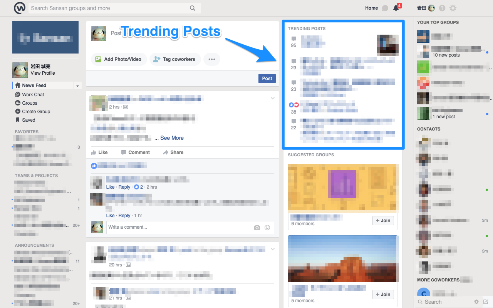

#### After

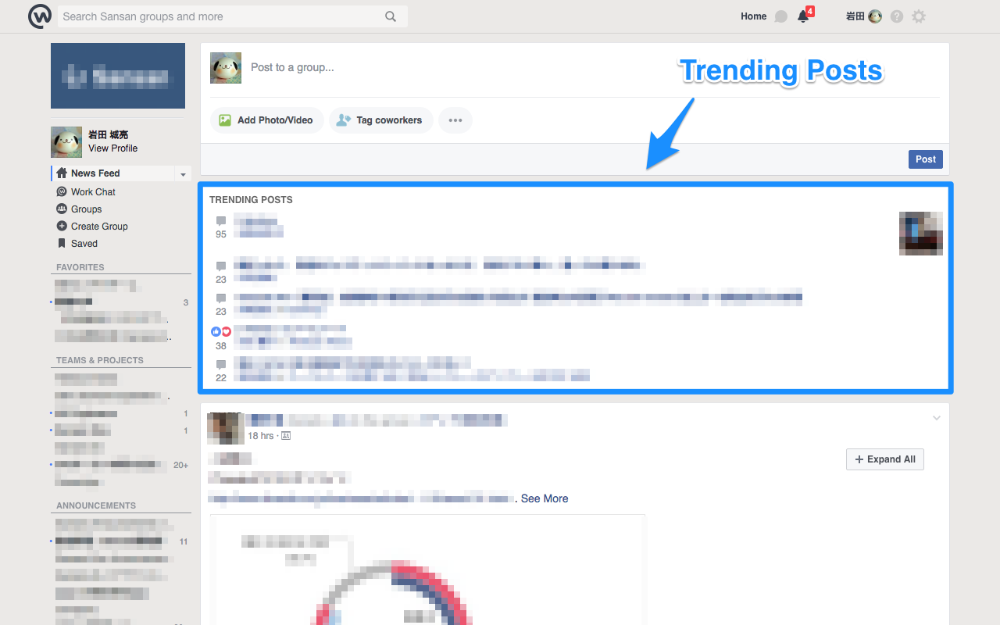

右サイドバーが非表示になるため、右サイドバー内のトレンド投稿をコンテンツ領域に表示します。
副次効果として、トレンド投稿の領域が広がるため、投稿内容が省略表示されなくなります。

### 5. 縮小された投稿を展開する「全て展開」ボタンを配置する

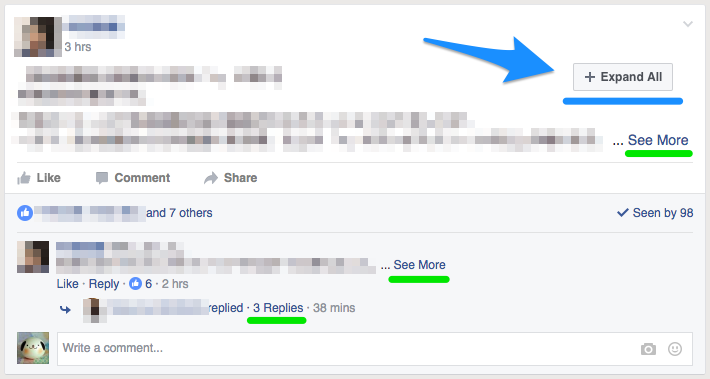

各投稿ごとに、縮小された投稿を展開する「全て展開」ボタンを配置します。

Workplace では長文の投稿内容や一定件数以上のコメントは適度に省略されます。
省略された内容を表示するには、以下のようなリンクを個別にクリックする必要があり面倒です。

- もっと見る
- 以前のコメントを見る
- 他x件のコメントを表示
- 返信x件

「全て展開」ボタンをクリックすると、縮小された投稿が自動的に展開され、省略されている全ての内容を確認できます。

### 6. ページ右下に「トップに戻る」ボタンを配置する

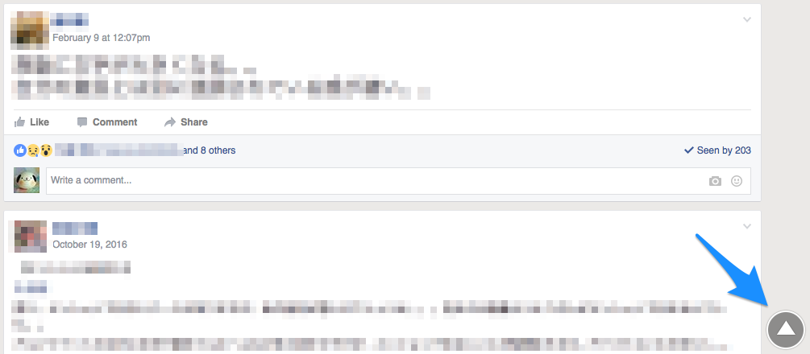

ページ (厳密にはコンテンツ領域) の右下に「トップに戻る」ボタンを配置します。

### 7. 自分へのメンションを少しだけ目立たせる

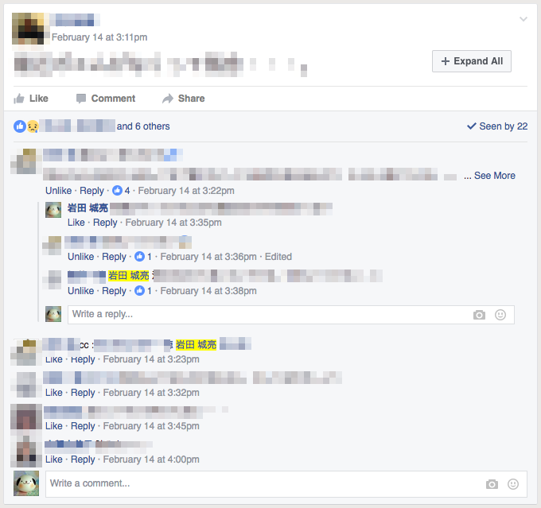

自分へのメンションを少しだけ目立たせます。
見落としがちな自分へのメンションにちょっとだけ気付きやすくなります。

### 8. 「最近のアクティビティ/過去の投稿」ヘッダーを少しだけ目立たせる

#### Before

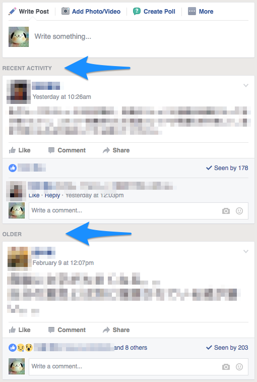

#### After

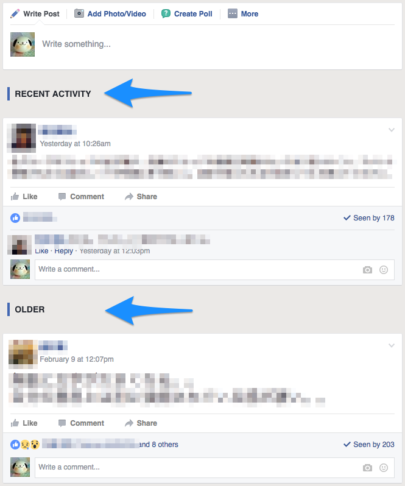

「最近のアクティビティ/過去の投稿/固定された投稿」ヘッダーを少しだけ目立たせることで、
「最新の投稿だけ見ていたつもりが、いつの間にか過去の投稿を見ていた」なんて事態を防ぎます。

### 9. 左サイドバーのサブヘッダーを少しだけ目立たせる

#### Before

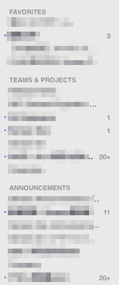

#### After

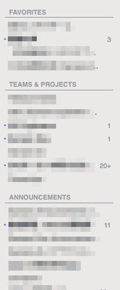

左サイドバーのサブヘッダーに区切り線を入れて少しだけ目立たせます。
それだけです。

## フィードバック

* [Issues](https://github.com/rockwillj/Workplace-Readable/issues) (日本語 OK)
* [Pull Requests](https://github.com/rockwillj/Workplace-Readable/pulls) (日本語 OK)

## Copyright & License

Copyright © 2017 Josuke Iwata (@rockwillj) 
Copyright © 2016 Atsushi Kambara (@atsukanrock, in Expand All feature)

This software is released under the MIT License, see [LICENSE](LICENSE).
